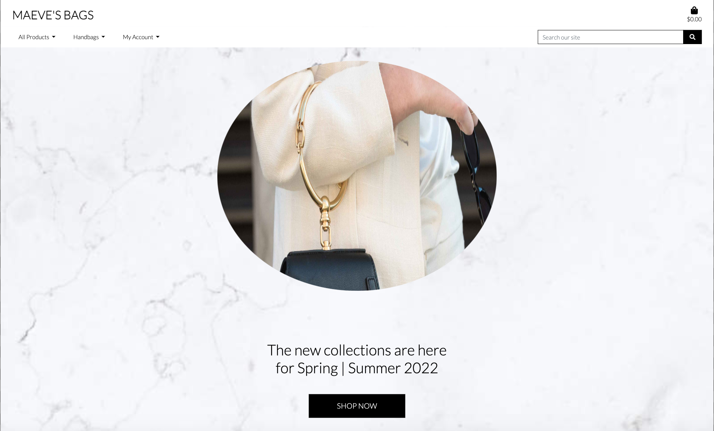
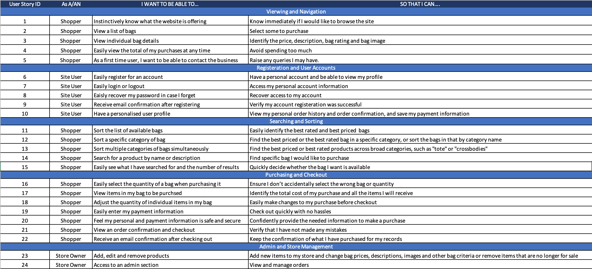
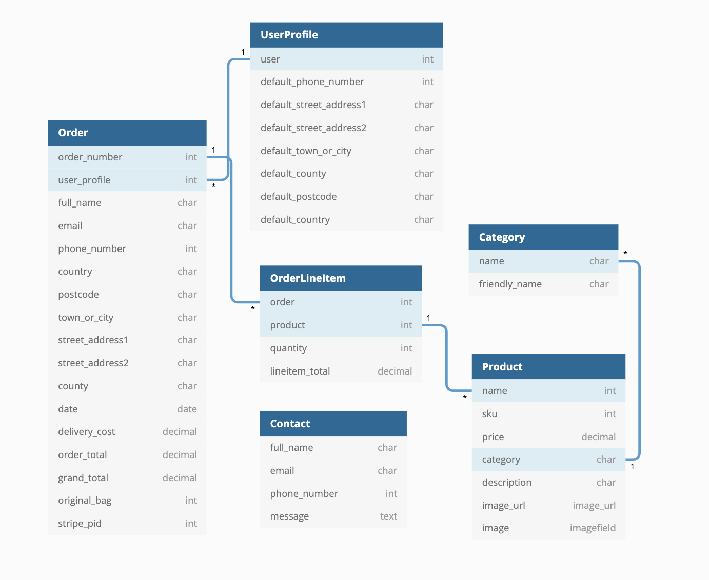

<h1 align="center">Maeve's Bags</h1>



View the repository in GitHub [here](https://github.com/MaeveHughes/Maeves-Bags)

View the live project [here] (https://maevesbags.herokuapp.com/)

Responsive Design for Ipad and Iphone:
    - [IPad](documentation/IpadHomePage.png)
    - [IPhone](documentation/IPhoneHomePage.png)

# Project Overview

Maeve's Bags was built as the 5th milestone project as part of Code Institute's Full Stack Software Software Development course. The full stack application uses a Django framework, HTML, CSS, Javascript and Python. 

Maeve's Bags is an ecommerce web application for customers seeking to purchase bags online. Visitors to the site would be able to browse all products by sorting, searching and by the various bag categories. Visitors can also register for an account to view past orders and contact the company with any queries.

Please note that the website is for educational purposes only. Stripe's credit card payment functionality is active but remains in a "test mode" so that no payments will be taken. Please do not enter any personal credit/debit card numbers whilst using the site. 

When testing this app, to make a payment, the following details should be used:

* Card number: 4242 4242 4242 4242
* CVC: any three numbers
* Date: any future date
* ZIP Code: any five numbers

# Contents

1. [User Experience (UX)](#user-experience-(ux))
    - [Strategy](#strategy)
    - [Scope](#scope)
    - [Structure](#structure)
    - [Skeleton](#skeleton)
    - [Surface](#surface)
2. [Information Architecture](#information-architecture)
    - [Database](#database)
    - [Data Model](#data-model)
3. [Technologies Used](#technologies-used)
4. [Testing](#testing)
5. [Deployment](#deployment)
    - [Local Deployment](#local-deployment)
    - [Deployment to Heroku](#deployment-to-heroku)
    - [Storing Static Files with AWS](#storing-static-files-with-aws)
    - [Connecting Stripe to Heroku](#connecting-stripe-to-heroku)
6. [Credits](#credits)
    - [Code](#code)
    - [Media](#media)
    - [Blog Credits](#blog-credits)
7. [Acknowledgments](#acknowledgments)

# User Experience (UX)

## Strategy

### User Stories

#### Viewing & Navigation
1. As a first time user, I would like to instinctively know what the website is offering. 
2. As a first time user, I would like to view a list of bags.
3. As a first time user, I want to be able to view individual bag details.
4. As a first time user, I want to be able to easily view the total of my purchases at any time.
5. As a first time user, I want to be able to contact the business with any queries I may have. 

#### Registration & User Accounts
6. As a site user, I want to be able to easily register for an account.
7. As a site user, I want to be able to easily login or logout.
8. As a site user, I want to be able to easily recover my password in case I forget.
9. As a site user, I want to be able to receive email confirmation after registering. 
10. As a site user, I want to have a personalised user profile.

#### Sorting & Searching
11. As a site user, I want to be able to sort the list of available bags.
12. As a site user, I want to be able to sort a specific category of bag.
13. As a site user, I want to be able to sort multiple categories of bags simultaneously.
14. As a site user, I want to be able to search for a product by name or description.
15. As a site user, I want to be able to easily see what I have searched for and the number of results.

#### Purchasing & Checkout
16. As a purchasing user, I want to be able to easily select the quantity of a bags when purchasing it / them.
17. As a purchasing user, I want to be able to view items in my bag to be purchsed.
18. As a purchasing user, I want to be able to adjust the quantity of individual items in my bag.
19. As a purchasing user, I want to be able to easily enter my payment information.
20. As a purchasing user, I want to be able to feel my personal and payment information is safe and secure.
21. As a purchasing user, I want to be able to view an order confirmation and checkout.
22. As a purchasing user, I want to receive an email confirmation after checking out.

#### Admin & Store Management
23. As a site owner, I want to be able to add, edit and remove products from the site easily. 
24. As a site owner, I want access to an admin section to view and manage orders. 

The User Stories were tracked and managed using an excel workbook, similiar to the process on the Code Institutes Boutique Ado project:



## Scope

The key features of the website were developed based on the user stories.

### For any site user: 

- Home page, with striking image of a fashionable person holding a handbag on their arm which quickly helps users to understand the purpose of the site.

- Products Page, where users can view all the products or products based on filtering criteria. 

- Product Detail Page, detailing information about the product. From here users can add products to their bags or decide to return to the products page.

- Shopping Bag page, where users can see what products have been added to their bag and adjust the quantity as needed.

- Checkout page, allowing users to purchase products. 

- Confirmation page, allowing users to see a confirmation of their order.

- Contact Page, where users can view the contact details for the company and contact the company using the contact form.

- Sign Up Page, where users can register to become a registered user.

### For registered users: 

All of the above plus: 

- Profile Page, where users can update their default delivery information allowing for ease at checkout. 

- Order History, from the profile page, users can see the previous orders they have made. 

- Log Out Page, where users can log out of their account. 

### For Site Admin:

All of the above plus: 

- Site management page, where admin users can add, edit and delete products.

## Structure

This website has 10 custom built pages and 14 (not all are used) account operations Django Allauth pages. The navbar at the top of the screen gives users access to the most important pages at all times.

#### Pages

**Accessible to all users**

* Header and navigation bar - The brang name is on the top left corner with a link to home page. Visible only on large screens. The navbar consists of the products navigation menu, with sorting or filtering possibilities. My account dropdown list of options for register and login. When registered, the dropdown list contains profile and logout links. There is a search bar for looking after products by name or key words in description. Bag icon with link to your bag list items and the total price of the selected order. The mobile navbar has the same search and cart links, however rather than links to the products, there is a collapsible side nav which is triggered by a burger menu. 

* Home - The landing page of the site, with striking image of a fashionable woman holding a handbag on their arm and a informative statement outlining "The new collections are here for Spring | Summer 2022", followed by a shop now button. This is sitting on a marble background image. This gives first time visitors a nice welcome.

* Products - This is a list of all products when clicking on the shop now button on the home page, clicking on a category in the navbar, or performing a search. There is a sorting option for prices and rating in ascending or descending way. The layout of the products page is similar to that of the Boutique Ado walkthrough project by displaying 4 products in a row on extra large screens, 3 on large screens, 2 on medium and small devices and 1 on extra small screen sizes. Basic product information is displayed below the product image (product name, price and a view product details button). As there may be a large amount of products displayed on a page, I have added a back to top button which appears when the user scrolls to the bottom of the page. I have deliberately put this at the bottom of the page so the focus is not drawn away from the products.

* Product Detail - When choosing one specific product, a new page opens that contains the chosen product, its details, input quantity option and a button to add it to bag. Admin users are also able to edit and delete products using the icons featured in this section. Products can be added to the bag by clicking the add to bag button. Users can return to an all products view by clicking the "Continue Shopping" button.

* Cart - A user purchases an item by adding it to the cart. The Cart is the users digital shopping cart, containing all products the user has added to it and their details, including the chosen quantity. Each product from the bag contains its name, image, price, quantity selected and the subtotal which is price multiplied by quantity. The user has the option to update each products quantity or remove it (this is only currently available on desktop view). The grand total with delivery included is displayed and two buttons: one to proceed to checkout and one to go back and shop more. If a user does not meet the free delivery threshold a helpful message will be displayed to let them know what they need to spend in order to qualify for free delivery. If the user has no items in the shopping bag, a message is displayed to the user to let them know this and a button to take the user to the all products page is displayed.

* Checkout - The checkout page features a form for the user to fill in, with name, email, phone number, delivery address. The checkout page contains the payment form from Stripe that takes: card number, CVC, expiry date and ZIP code. The page includes an order summary , as a table with products name, images (images are links that will take the user back to the product details page for that product details)quantity selected, subtotal. Also, the delivery costs, grand total and a button that redirects to bag for adjusting it if needed. From the checkout page, if user is authenticated, they can save their details to their My Profile so they are prefilled for the next order. 

* Order Confirmation - The page shows when a payment has successfully been made and an order confirmation will be displayed to the user. The confirmation will also be sent to the given email address during checkout. If the order was successful, the cart will be emptied. In the confirmation, the user can view the items order, the quantity, an order number, grand total and delivery details. At the bottom of the page their is a link back to the products to encourage users to purchse more items.

* Sign In - The page gives users the ability to log into the site by using a form. Users have to provide their username and password. There is two buttons at the bottom of the page: One to log in and one back to the home page.

* Sign Up - The page gives users the ability to register by using a form. Users have to provide their email address, email address confirmation, username, password and password confirmation. There is two buttons at the bottom of the page: One to register and one back to the login page.

* Contact - A simple contact form that is sent to the site owner and the page also includes the companys contact details. The form is sent by email to the site owner. Contact messages can be located on the site administration page (for superusers only).


**Accessible to signed in users**

* My Profile - Each user can access their own personal profile to view order history and the users billing and shipping details is here. A message to inform the user that this is a past order confirmation is displayed to avoid confusion.

* Sign Out - The page gives users the ability to log out of the site. There is two buttons at the bottom of the page: One to log in and one back to the products page.

* Other accounts operations pages such as Forgot Password.

**Accessible to Admin users**

* Add Product - This is where admin users can add new products to the website. Admin users have to fill out a form with the following details: name, sku, price, category, rating, description and also have the option to upload an image. If the admin user decides not to use an image it will use the default image. At the end of the form there is two buttons: one to add product and the other to cancel which will bring the user back to the admin page.

* Edit Product - The page for admin users to edit or delete products. In order to access this page the admin user will have to open a particular product and select the buttons edit or delete. If the user decides to edit a product they have the option to edit the following details: name, sku, price, category, rating, description and image. If the user clicks on the delete button the product is automatically deleted.


#### Pages provided by Django

These pages are provided by the Allauth package of the Django framework, but are customised by me to fit in with the rest of the site. Read more about Allauth [here](https://django-allauth.readthedocs.io/en/latest/)

* Sign Up - where users can register for an account on the site.

* Sign in - Registered users can log accessing their personal info etc by signing in.

* Sign Out - Registered users can log out of the site.

* Various pages for email verification and password reset, etc.


#### Features left to implement
* An option for users to leave a review /rating on each product.
* A welcome or discount offer for new customers, such as 20% off their first order, to encourage more registrations.
* Additional payment options such as Apple Pay or Paypal for ease of purchasing.


## Skeleton

Below you can find the links for my wireframes, showing how I would like the pages to be structured, and how the site will appear on different device sizes. 

The wireframes have been created using moqups and show for Desktop, iPad and iPhone. 

- Home Page
    - [Desktop](documentation/wireframes/HomePageDesktopWireframe.png)
    - [iPad](documentation/wireframes/HomePageIPadWireframe.png)
    - [iPhone](documentation/wireframes/HomePageIPhoneWireframe.png)
- All Products Page
    - [Desktop](documentation/wireframes/ProductsDesktopWireframe.png)
    - [iPad](documentation/wireframes/ProductsIPadWireframe.png)
    - [iPhone](documentation/wireframes/ProductsIPhoneWireframe.png)
- View Product Page
    - [Desktop](documentation/wireframes/ProductDetailsDesktopWireframe.png)
    - [iPad](documentation/wireframes/ProductDetailsIPadWireframe.png)
    - [iPhone](documentation/wireframes/ProductDetailsIPhoneWireframe.png)
- Bag Page
    - [Desktop](documentation/wireframes/BagDesktopWireframe.png)
    - [iPad](documentation/wireframes/BagIPadWireframe.png)
    - [iPhone](documentation/wireframes/BagIPhoneWireframe.png)
- Checkout Page
    - [Desktop](documentation/wireframes/CheckoutDesktopWireframe.png)
    - [iPad](documentation/wireframes/CheckoutIPadWireframe.png)
    - [iPhone](documentation/wireframes/CheckoutIPhoneWireframe.png)
- Confirmation Page
    - [Desktop](documentation/wireframes/ConfirmationDesktopWireframe.png)
    - [iPad](documentation/wireframes/ConfirmationIpadWireframe.png)
    - [iPhone](documentation/wireframes/ConfirmationIPhoneWireframe.png)
- Contact Us Page
    - [Desktop](documentation/wireframes/ContactDesktopWireframe.png)
    - [iPad](documentation/wireframes/ContactIPadWireframe.png)
    - [iPhone](documentation/wireframes/ContactIPhoneWireframe.png)

## Surface

### Design

#### Colour Scheme

- I wanted to create a basic colour scheme for this site so the products would stand out to the users. I picked a marble image from postermywall to be the background image on all the pages on the site. This is a modern and on trend look for the site and does not take away from the products which was the main objective. The marble background is off white and a light shade of black. I wanted to keep this colour scheme throughout the site. The font throught the site is mainly black. I was concerned that black and white can be quite bland, so wanted to ensure the site was catching to the eye at the same time so added pop of green and white for some of the buttons on the site. The colours were taken from bootstrap.

#### Typography
- I have used Lato throughtout the site. This font was stratgeically chosen as it is elligible in lowercase and uppercase. As the colouring on the site is quite simple, I wanted the font to reflect the same.

#### Imagery
- Due to the nature of the products I have had to rely on other retailer's products and modify them for use on my site. For the most part product images have come from [Zalando](https://www.zalando.ie/) and other online retailers (credited in the credits section).

- I have used an image of a stylish woman holding a handbag on the home page. The tones of colour on the image (cream, black gold and brown) compliment the colour scheme of the site. Image credits can be found in the credit section of the README.

#### Icons

- I've made use of icons in various sections on the site. They have been used for navigation: cart, social media links, product tags, search bar and checkout. All icons have been obtained from FontAwesome. 

## Information Architechture:

### Database Choice:

- SQLight was used in development, as it comes pre-installed with Django.
- PostgreSQL was used for the deployed site, as it is offered as an optional add-on by Heroku.

### Data Modeling:

- The image below was produced using the [dbdiagram.io](https://dbdiagram.io/)



### Checkout App

- Order Model
    - Contains details of the user's orders, their delivery details, and the items they've ordered. It is linked to the UserProfile Model by the 'user_profile' field

- OrderLineItem Model
    - Contains details for the customer order, quantity and product total. It is linked to the Order Model by the 'order' field and the Product Model by the 'product field'.
    
### Products App

- Category
    - Contains Product Categories options for products. It is linked to the Product Model using a foreign key.

- Product
    - Contains detailed product information for each product. 
 
### Contact App

- Contact
    - Contains the details of users and their queries from the contact form. 

### Profiles App

- UserProfile
    - Contains the user's details for future orders. 

### Fixtures

Fixtures were created for the following:
- Category
- Product

# Technologies Used

## Languages Used

- HTML5
- CSS3
- Javascript
- Python

### Frameworks, Libraries and Other Sources Used:

- [Django](https://www.djangoproject.com/) was used as the principal framework for the project.
- [Django Crispy Forms](https://django-crispy-forms.readthedocs.io/en/latest/) was used for all forms on the site.
- [Django Allauth](https://django-allauth.readthedocs.io/en/latest/) was used for user authentication on the site.
- [Stripe](https://stripe.com/) was used to handle payments on the site.
- [Bootstrap4](https://getbootstrap.com/) was used to aid reponsive design.
- [Amazon Web Services](https://aws.amazon.com/) S3 was used to store all static CSS and Javascript files, and images.
- [SQLite3](https://www.sqlite.org/index.html) is the database that was used in production.
- [PostgreSQL](https://www.postgresql.org/) is the database used by the deployed site.
- [Heroku](https://www.heroku.com/) hosts the Milestone Project 04 website.
- [JQuery](https://jquery.com/) was used extensively throughout the site, in order to provide functionality for Bootstrap elements, and for Stripe. 
- [GitPod](https://gitpod.io/) was used as an IDE for this project. 
- [GitHub](https://github.com/) is where the Milestone Project 04's repository is stored. Regular commits were made throughout, and code was pushed to GitHub from GitPod.
- [Font Awesome](https://fontawesome.com/) was used for icons on the site.

# Testing

 - There is a link on the contact page to the Facebook business page and there is also dead links to Instagram, Youtube and Twitter, all styled using their icons. [Screenshot of the facebook page](documentation/facebook.png)
 - There are no errors and warnings in the Developer console
 - Tested using lighthouse and it passes the result
 - The page is fully responsive and has been tested using the Developer console.
 - Tested about, bag, check out, contact, home, review and products pages in all devices. All working fine.
 - There is no error in python codes as it passes through Pep8 online check.
 - There is no error in javascript codes as it passes through JsHint.
 - There is no error in CSS and HTML as it passes through W3C validators.
 - All the codes were formatted using git pod buit-in document formatter.
 - Tested every functionality like Stripe, add/edit/delete products, email, contact, check out, and confirmation email. All working fine.

# Deployment

### Heroku deployment with AWS:

- The Maeve's Bags website was deployed to [Heroku](https://www.heroku.com/) using the following steps:

1. Install gunicorn, psycopg2-binary and dj-database-url using the ```PIP Install``` command.
2. Freeze all the requirements for the project into a requirements.txt file using the ```pip3 freeze > requirements.txt``` command.
3. Create a procfile, with the following inside it: ```web: gunicorn maevesbags.wsgi:application```.
4. Push these changes to GitHub, using ```git add .```, ```git commit -m``` and ```git push``` commands.
5. Navigate to [Heroku](https://www.heroku.com/), and login or create an account.
6. Once logged in, click on 'resources'.
7. From the add-ons search bar, add the Heroku Postgres DB, select the free account, and then submit order form to add it to the project.
8. From the app's dashboard, click on 'settings', and then 'reveal config vars' in order to set the necessary configuration variables for the project. 
It should look like this: 

| Key                   | Value                      |
|-----------------------|----------------------------|
| AWS_ACCESS_KEY_ID     | Your AWS Access Key        |
| AWS_SECRET_ACCESS_KEY | Your AWS Secret Access Key |
| DATABASE_URL          | Your Database URL          |
| EMAIL_HOST_PASS       | Your Email Password        |
| EMAIL_HOST_USER       | Your Email Address         |
| SECRET_KEY            | Your Secret Key            |
| STRIPE_PUBLIC_KEY     | Your Stripe Public Key     |
| STRIPE_SECRET_KEY     | Your Stripe Secret Key     |
| STRIPE_WH_SECRET      | Your Stripe WH Key         |
| USE_AWS               | TRUE                       |

9. Back on the main dashboard, click on 'deploy', and then under the 'Deployment' method section, select GitHub and 'Automatic Deploys'.
10. Ensure that in settings.py, the following code is commented out:
```
Database
 https://docs.djangoproject.com/en/3.1/ref/settings/#databases
```
and the at the following code is added:
```
DATABASES = {
        'default': dj_database_url.parse(os.environ.get('DATABASE_URL'))
    }
```
11. Make migrations using the following command:
```
python3 manage.py makemigrations
```
and migrate the database models to the Postgres database using the following command:
```
python3 manage.py migrate
```
12. Load the fixtures from the 'product_types.json' file and then from the 'products.json' file - which are contained in the 'fixtures' folder into the database. 
This is done by using the following command:
```
python3 manage.py loaddata <file name>
```
13. Create a new superuser with the following command:
```
python3 manage.py createsuperuser
```
and then enter chosen email, username and password.
14. In settings.py, contain the previously entered database setting in an if statement, and add an else condition, so that different databases are 
used depending on the environment.
```
if 'DATABASE_URL' in os.environ:
    DATABASES = {
        'default': dj_database_url.parse(os.environ.get('DATABASE_URL'))
    }
else:
    DATABASES = {
        'default': {
            'ENGINE': 'django.db.backends.sqlite3',
            'NAME': BASE_DIR / 'db.sqlite3',
        }
    }
```
15. Disable 'COLLECTSTATIC' with the fillowing code: ``` heroku config:set DISABLE_COLLECTSTATIC=1 ``` 
so that Heroku doesn't attempt to collect the static files.
16. Add ```ALLOWED_HOSTS = ['milestone-project-04.herokuapp.com', 'localhost']``` to settings.py.
17. Add Stripe environment variables to settings.py.
18. Push to Heroku using the following command:
```git push heroku main```

### Amazon Web Services:

All Static and media files for the deployed version of the site are hosted in a Amazon Web Services(AWS) S3 bucket. 
In order to create your own bucket, please follow the instructions on the AWS website 
[Here](https://docs.aws.amazon.com/AmazonS3/latest/userguide/creating-bucket.html)

1. In the gitpod terminal, install boto3 and django-storages using the following commands:
```pip3 install boto3 ``` and ```pip3 install django-storages```
2. Freeze the new requirements into the 'requirements.txt' file using the ```pip3 freeze > requirements.txt``` command
3. Add 'storages' to INSTALLED_APPS in settings.py.
4. Add the following code to settings.py in order to link the AWS bucket to the website:
```
if 'USE_AWS' in os.environ:
    # Cache control
    AWS_S3_OBJECT_PARAMETERS = {
        'Expires': 'Thu, 31 Dec 2099 20:00:00 GMT',
        'CacheControl': 'max-age=94608000',
    }

    # Bucket Config
    AWS_STORAGE_BUCKET_NAME = 'milestone-project-04'
    AWS_S3_REGION_NAME = 'eu-west-1'
    AWS_ACCESS_KEY_ID = os.environ.get('AWS_ACCESS_KEY_ID')
    AWS_SECRET_ACCESS_KEY = os.environ.get('AWS_SECRET_ACCESS_KEY')
    AWS_S3_CUSTOM_DOMAIN = f'{AWS_STORAGE_BUCKET_NAME}.s3.amazonaws.com'

    # Static and media files
    STATICFILES_STORAGE = 'custom_storages.StaticStorage'
    STATICFILES_LOCATION = 'static'
    DEFAULT_FILE_STORAGE = 'custom_storages.MediaStorage'
    MEDIAFILES_LOCATION = 'media'

    # Override static and media URLs in production
    STATIC_URL = f'https://{AWS_S3_CUSTOM_DOMAIN}/{STATICFILES_LOCATION}/'
    MEDIA_URL = f'https://{AWS_S3_CUSTOM_DOMAIN}/{MEDIAFILES_LOCATION}/'
```
5. Create a custom_storages.py file in the root level of the project. Inside it, include the locations of the Static Storage and Media Storage.
6. Delete DISABLE_COLLECTSTATIC from the Heroku Config Variables.
7. Finally, push to GitHub, and all changes should be automatically pushed to Heroku too.

## Credits:

### Code:

- **Code Institute Boutique Ado Project**: Code institutes Boutique Ado app provided the building blocks for the project and was used as a primary resource.

- **Code Institute Slack Channels**: Slack was used extensively for debugging, and to look for ideas off other students and CI staff members.

-**W3 Schools**: W3 Schools was referenced for debugging purposes.

### Images: 

- All product images and descriptions are the property of Zalando, Brown Thomas, Prada, Farfetch, Mulberry, Marc Jacobs, Gucci and Chanel websites.

- The background image on the site is from [postermywall](https://www.postermywall.com/)

- The homepage image, is from [lofficiel](https://www.lofficiel.at/)

- All images and content sourced for the website are for educational purposes only. 


### Content:

- All content on the site was either taken from the Boutique Ado project, Zalando, Brown Thomas, Prada, Farfetch, Mulberry, Marc Jacobs, Gucci and Chanel websites or written by the developer.

## Acknowledgements:

- **My Mentor** Thanks to my mentor Gerard Mcbride for his time and support. 
- **My Friends and Family** for constant support, and feedback on the content and functionality.
- **Code Institute Tutor Support** Code Institute's tutor team for support in aiding with minor bug fixes. 